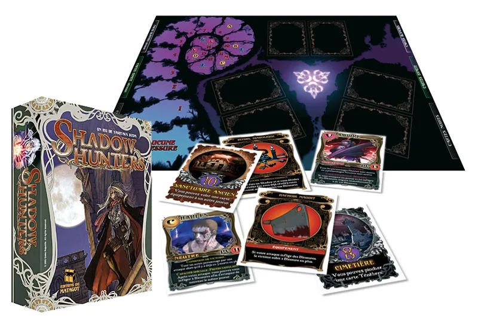
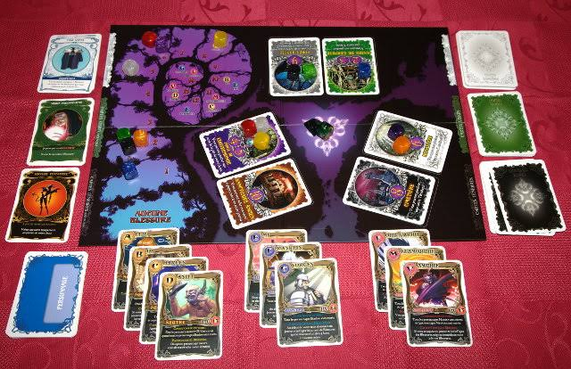
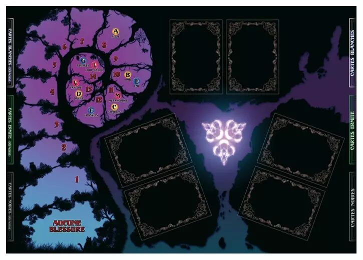
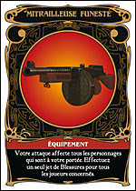
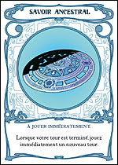
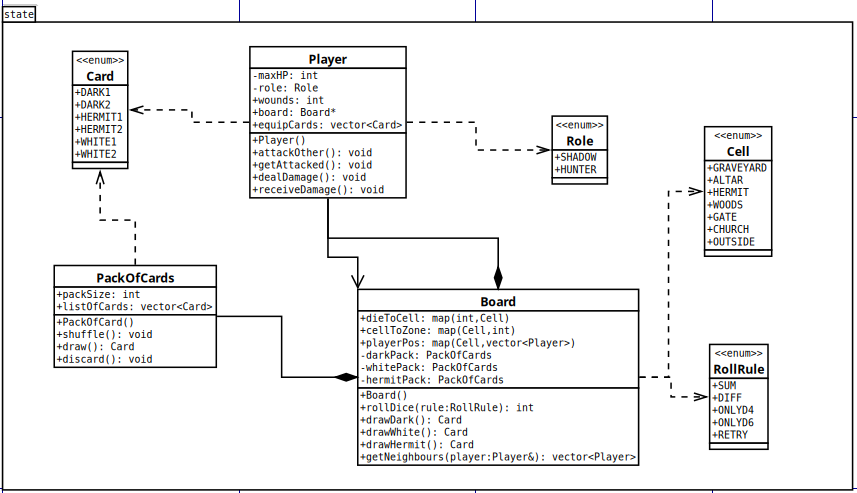

# Projet Logiciel Transversal

---

#### Prénom NOM – Prénom NOM
> Clovis    – Pressard  
> Nathan    – Groussard  
> Maël      – Lukas  
> Léo       – Boutonnet  
---

## Sommaire

- [1 Objectif](#1-objectif)
  - [1.1 Présentation générale](#11-présentation-générale)
  - [1.2 Règles du jeu](#12-règles-du-jeu)
  - [1.3 Conception Logiciel](#13-conception-logiciel)
- [2 Description et conception des états](#2-description-et-conception-des-états)
  - [2.1 Description des états](#21-description-des-états)
  - [2.2 Conception logicielle](#22-conception-logicielle)
  - [2.3 Conception logicielle: extension pour le rendu](#23-conception-logicielle-extension-pour-le-rendu)
  - [2.4 Conception logicielle: extension pour le moteur de jeu](#24-conception-logicielle-extension-pour-le-moteur-de-jeu)
  - [2.5 Ressources](#25-ressources)
- [3 Rendu: Stratégie et Conception](#3-rendu-stratégie-et-conception)
  - [3.1 Stratégie de rendu d'un état](#31-stratégie-de-rendu-dun-état)
  - [3.2 Conception logicielle](#32-conception-logicielle)
  - [3.3 Conception logicielle: extension pour les animations](#33-conception-logicielle-extension-pour-les-animations)
  - [3.4 Ressources](#34-ressources)
  - [3.5 Exemple de rendu](#35-exemple-de-rendu)
- [4 Règles de changement d'états et moteur de jeu](#4-règles-de-changement-détats-et-moteur-de-jeu)
  - [4.1 Horloge globale](#41-horloge-globale)
  - [4.2 Changements extérieurs](#42-changements-extérieur)
  - [4.3 Changements autonomes](#43-changements-autonomes)
  - [4.4 Conception logicielle](#44-conception-logicielle)
  - [4.5 Conception logicielle: extension pour l'IA](#45-conception-logicielle-extension-pour-lia)
  - [4.6 Conception logicielle: extension pour la parallélisation](#46-conception-logicielle-extension-pour-la-parallélisation)
- [5 Intelligence Artificielle](#5-intelligence-artificielle)
  - [5.1 Stratégies](#51-stratégies)
    - [5.1.1 Intelligence minimale](#511-intelligence-minimale)
    - [5.1.2 Intelligence basée sur des heuristiques](#512-intelligence-basée-sur-des-heuristiques)
    - [5.1.3 Intelligence basée sur les arbres de recherche](#513-intelligence-basée-sur-les-arbres-de-recherche)
  - [5.2 Conception logicielle](#52-conception-logicielle)
  - [5.3 Conception logicielle: extension pour l'IA composée](#53-conception-logicielle-extension-pour-lia-composée)
  - [5.4 Conception logicielle: extension pour IA avancée](#54-conception-logicielle-extension-pour-ia-avancée)
  - [5.5 Conception logicielle: extension pour la parallélisation](#55-conception-logicielle-extension-pour-la-parallélisation)
- [6 Modularisation](#6-modularisation)
  - [6.1 Organisation des modules](#61-organisation-des-modules)
    - [6.1.1 Répartition sur différents threads](#611-répartition-sur-différents-threads)
    - [6.1.2 Répartition sur différentes machines](#612-répartition-sur-différentes-machines)
  - [6.2 Conception logiciel](#62-conception-logiciel)
  - [6.3 Conception logiciel: extension réseau](#63-conception-logiciel-extension-réseau)
  - [6.4 Conception logiciel: client Android](#64-conception-logiciel-client-android)

## 1 Objectif

### 1.1 Présentation générale
Durant ce projet, l'objectif est de reproduire le jeu Shadow Hunter. Shadow Hunter est un jeu de plateau, développé par Yasutaka Ikeda, c'est un jeu de bluff où le but est de faire gagner son camp, que ce soit les Hunter, Shadow ou les personnages neutres. Pour ce faire, le joueur devra réussir à déterminer qui sont ses alliés et qui sont ses ennemis. Ce jeu, à travers sa partie bluff, peut faire penser au jeu du loup-garou mais la comparaison en reste là, car contrairement à ce dernier qui tourne autour des débats, Shadow Hunter introduit des mécaniques bien différentes, que ce soit par la possibilité de combattre avec les joueurs, l'attribution de différents rôles, l'utilisation de cartes d’équipement et à effet immédiat. Cela apporte ainsi de nouveaux niveaux de complexité dans l'obtention de la victoire.
Le plateau de jeu peut être vu en Figure 1.

 <figure style="text-align: center;">
  
  <figcaption> <strong>Figure 1 :</strong> Shadow Hunter</figcaption> 
</figure> 

Exemple de rendue d'une partie:
 <figure style="text-align: center;">
  
  <figcaption> <strong>Figure 2 :</strong> Représentation d'une partie</figcaption> 
</figure> 

### 1.2 Règles du jeu
Le jeu est divisé en trois camp:
- les Shadows ayant pour but d'éliminer les groupes adverse
- les Hunters ont le même but que les Shadows
- les Neutres ont des conditions de victoire propre au rôle du joueur  

Dans les camps chaque rôle à un effet qui lui est propre et qui peut être utilisé uniquement après que ce dernier ce soit révêler. Les effets peuvent être utilisable qu'une seule fois par tour ou une unique fois par partie.

Le plateau visible à la Figure 3 trois parties :
- une partie à gauche contenant les points de vie ainsi que les informations à propos des points de vie max des différents rôles ;
- une partie au milieu contenant les cartes des différentes zones et lieux ;
- une partie à droite contenant les cartes effets (les cartes Ténèbres, les cartes Lumières et les cartes Vision)

 <figure style="text-align: center;">
  
  <figcaption> <strong>Figure 3 :</strong> Plateau de jeu</figcaption> 
</figure> 

Les cartes effets sont divisé en deux:
- Les cartes vision qui ont pour but de donner une information sur le camps du joueur ciblé;
- Les cartes équipement:
    - Les cartes Ténèbres doivent être dévoiler aussitôt aux autres joueurs.Certaines cartes sont des équipement et d'autre à jouer immédiatement, ces derniers sont d'avantages tournés offensif et sabotage;
         <figure style="text-align: center;">
        
        <figcaption> <strong>Figure 5 :</strong> Carte Ténèbre</figcaption> 
        </figure> 

    - Les cartes Lumières doivent être dévoiler aussitôt aux autres joueurs.Certaines cartes sont des équipement et d'autre à jouer immédiatement, ces derniers sont d'avantages tournés défensif et soutien.
         <figure style="text-align: center;">
        
        <figcaption> <strong>Figure 6 :</strong> Carte Lumière</figcaption> 
        </figure> 

Déroulement d'une partie:
- Avant de commencer la partie, le positionnement des différents lieux est faites de manières aléatoires. 
Après cela les joueurs ont leurs rôles attribué aléatoirement, puis ces derniers ont leurs ordre définis par un lancer de dé.
- Un tours de jeu commence par un lancer de dé pour savoir où le joueur doit aller, ainsi lorsque qu'il lance son dé ce dernier va dans le lieux indiqué par valeur mais si il ce retrouve sur le même lieux il doit relancer le dé. Dans le cas où il fait un 7 il peut aller dans n'importe quel lieux à l'exception du lieux sur lequel il se trouve.  
Le joueur effectue l'effet ou non indiqué sur la carte lieux et si il y a un joueur au sein de la même zone ce dernier à la possibilité d'effectuer une attaque contre ce dernier.
- La révélation peux ce faire à tout instant, même pendant le tour de l'adversaire.

Une partie peut être jouer de 4 à 8 joueurs changeant ainsi la répartition des camps
| Nombre de joueur | Nombre de Shadow | Nombre de Hunter | Nombre de Neutre |
|--------|---------|--------|---------|
| 4 | 2 | 2 | 0 |
| 5 | 2 | 2 | 1 |
| 6 | 2 | 2 | 2 |
| 7 | 2 | 2 | 3 (sauf Bob) |
| 8 | 3 | 3 | 2 (sauf Bob) |

### 1.3 Conception Logiciel
Pour la suite de la production du projet, a été décidé de partir sur le mode de jeu à 4 joueurs car ce dernier permet de rendre la première version à produire du projet plus simple car enlevant le camp Neutre, ce qui enlève de nombreuse condition de victoire différentes.

Etant donner que nous avons en notre possession le jeu, il est alors possible de scanner les différent élément du jeu afin de pouvoir les intégrers à notre code. L'ajout de cet aspect graphique est ce qui peut être produit ultérieuremnt.

## 2 Description et conception des états

L'objectif de cette section est une description très fine des états dans le projet. Plusieurs niveaux de descriptions sont attendus. Le premier doit être général, afin que le lecteur puisse comprendre les éléments et principes en jeux. Le niveau suivant est celui de la conception logicielle. Pour ce faire, on présente à la fois un diagramme des classes, ainsi qu'un commentaire détaillé de ce diagramme. Indiquer l'utilisation de patron de conception sera très apprécié. Notez bien que les règles de changement d'état ne sont pas attendues dans cette section, même s'il n'est pas interdit d'illustrer de temps à autre des états par leurs possibles changements.

### 2.1 Description des états
L'état du jeu est formé par 4 joueurs et un terrain. Le joueur 1 effectue ses différentes actions et les joueurs restant sont controllés par des Intelligences Artificielle (ou d'autre joueur).

#### 2.1.1 État du terrain

#### 2.1.1 État du joueur

### 2.2 Conception logicielle
	
### 2.3 Conception logicielle: extension pour le rendu

### 2.4 Conception logicielle: extension pour le moteur de jeu

### 2.5 Ressources

<figure style="text-align: center;">

<figcaption><strong>Figure 6 :</strong> Diagramme des classes d'état</figcaption>
</figure>

## 3 Rendu: Stratégie et Conception
Présentez ici la stratégie générale que vous comptez suivre pour rendre un état. Cela doit tenir compte des problématiques de synchronisation entre les changements d'états et la vitesse d'affichage à l'écran. Puis, lorsque vous serez rendu à la partie client/serveur, expliquez comment vous aller gérer les problèmes liés à la latence. Après cette description, présentez la conception logicielle. Pour celle-ci, il est fortement recommandé de former une première partie indépendante de toute librairie graphique, puis de présenter d'autres parties qui l'implémente pour une librairie particulière. Enfin, toutes les classes de la première partie doivent avoir pour unique dépendance les classes d'état de la section précédente.

### 3.1 Stratégie de rendu d'un état

### 3.2 Conception logicielle

### 3.3 Conception logicielle: extension pour les animations

### 3.4 Ressources

### 3.5 Exemple de rendu

Illustration 2: Diagramme de classes pour le rendu

## 4 Règles de changement d'états et moteur de jeu
Dans cette section, il faut présenter les événements qui peuvent faire passer d'un état à un autre. Il faut également décrire les aspects liés au temps, comme la chronologie des événements et les aspects de synchronisation. Une fois ceci présenté, on propose une conception logicielle pour pouvoir mettre en œuvre ces règles, autrement dit le moteur de jeu.

### 4.1 Horloge globale

### 4.2 Changements extérieurs

### 4.3 Changements autonomes

### 4.4 Conception logicielle

### 4.5 Conception logicielle: extension pour l'IA

### 4.6 Conception logicielle: extension pour la parallélisation

Illustration 3: Diagrammes des classes pour le moteur de jeu

## 5 Intelligence Artificielle
Cette section est dédiée aux stratégies et outils développés pour créer un joueur artificiel. Ce robot doit utiliser les mêmes commandes qu'un joueur humain, ie utiliser les mêmes actions/ordres que ceux produit par le clavier ou la souris. Le robot ne doit pas avoir accès à plus information qu'un joueur humain. Comme pour les autres sections, commencez par présenter la stratégie, puis la conception logicielle.
### 5.1 Stratégies

#### 5.1.1 Intelligence minimale

#### 5.1.2 Intelligence basée sur des heuristiques

#### 5.1.3 Intelligence basée sur les arbres de recherche

### 5.2 Conception logicielle

### 5.3 Conception logicielle: extension pour l'IA composée

### 5.4 Conception logicielle: extension pour IA avancée

### 5.5 Conception logicielle: extension pour la parallélisation

## 6 Modularisation
Cette section se concentre sur la répartition des différents modules du jeu dans différents processus. Deux niveaux doivent être considérés. Le premier est la répartition des modules sur différents threads. Notons bien que ce qui est attendu est un parallélisation maximale des traitements: il faut bien démontrer que l'intersection des processus communs ou bloquant est minimale. Le deuxième niveau est la répartition des modules sur différentes machines, via une interface réseau. Dans tous les cas, motivez vos choix, et indiquez également les latences qui en résulte.

### 6.1 Organisation des modules

#### 6.1.1 Répartition sur différents threads

#### 6.1.2 Répartition sur différentes machines

### 6.2 Conception logiciel

### 6.3 Conception logiciel: extension réseau

### 6.4 Conception logiciel: client Android

Illustration 4: Diagramme de classes pour la modularisation

