

# Projet Logiciel Transversal

---

#### Prénom NOM – Prénom NOM
> Clovis    – Pressard  
> Nathan    – Groussard  
> Maël      – Lukas  
> Léo       – Boutonnet  
---

## Sommaire

- [1 Objectif](#1-objectif)
  - [1.1 Présentation générale](#11-présentation-générale)
  - [1.2 Règles du jeu](#12-règles-du-jeu)
  - [1.3 Conception Logiciel](#13-conception-logiciel)
- [2 Description et conception des états](#2-description-et-conception-des-états)
  - [2.1 Description des états](#21-description-des-états)
  - [2.2 Conception logicielle](#22-conception-logicielle)
  - [2.3 Conception logicielle: extension pour le rendu](#23-conception-logicielle-extension-pour-le-rendu)
  - [2.4 Conception logicielle: extension pour le moteur de jeu](#24-conception-logicielle-extension-pour-le-moteur-de-jeu)
  - [2.5 Ressources](#25-ressources)
- [3 Rendu: Stratégie et Conception](#3-rendu-stratégie-et-conception)
  - [3.1 Stratégie de rendu d'un état](#31-stratégie-de-rendu-dun-état)
  - [3.2 Conception logicielle](#32-conception-logicielle)
  - [3.3 Conception logicielle: extension pour les animations](#33-conception-logicielle-extension-pour-les-animations)
  - [3.4 Ressources](#34-ressources)
  - [3.5 Exemple de rendu](#35-exemple-de-rendu)
- [4 Règles de changement d'états et moteur de jeu](#4-règles-de-changement-détats-et-moteur-de-jeu)
  - [4.1 Horloge globale](#41-horloge-globale)
  - [4.2 Changements extérieurs](#42-changements-extérieur)
  - [4.3 Changements autonomes](#43-changements-autonomes)
  - [4.4 Conception logicielle](#44-conception-logicielle)
  - [4.5 Conception logicielle: extension pour l'IA](#45-conception-logicielle-extension-pour-lia)
  - [4.6 Conception logicielle: extension pour la parallélisation](#46-conception-logicielle-extension-pour-la-parallélisation)
- [5 Intelligence Artificielle](#5-intelligence-artificielle)
  - [5.1 Stratégies](#51-stratégies)
    - [5.1.1 Intelligence minimale](#511-intelligence-minimale)
    - [5.1.2 Intelligence basée sur des heuristiques](#512-intelligence-basée-sur-des-heuristiques)
    - [5.1.3 Intelligence basée sur les arbres de recherche](#513-intelligence-basée-sur-les-arbres-de-recherche)
  - [5.2 Conception logicielle](#52-conception-logicielle)
  - [5.3 Conception logicielle: extension pour l'IA composée](#53-conception-logicielle-extension-pour-lia-composée)
  - [5.4 Conception logicielle: extension pour IA avancée](#54-conception-logicielle-extension-pour-ia-avancée)
  - [5.5 Conception logicielle: extension pour la parallélisation](#55-conception-logicielle-extension-pour-la-parallélisation)
- [6 Modularisation](#6-modularisation)
  - [6.1 Organisation des modules](#61-organisation-des-modules)
    - [6.1.1 Répartition sur différents threads](#611-répartition-sur-différents-threads)
    - [6.1.2 Répartition sur différentes machines](#612-répartition-sur-différentes-machines)
  - [6.2 Conception logiciel](#62-conception-logiciel)
  - [6.3 Conception logiciel: extension réseau](#63-conception-logiciel-extension-réseau)
  - [6.4 Conception logiciel: client Android](#64-conception-logiciel-client-android)

## 1 Objectif

### 1.1 Présentation générale
Durant ce projet, l'objectif est de reproduire le jeu Shadow Hunter. Shadow Hunter est un jeu de plateau, développé par Yasutaka Ikeda, c'est un jeu de bluff où le but est de faire gagner son camp, que ce soit les Hunter, Shadow ou les personnages neutres. Pour ce faire, le joueur devra réussir à déterminer qui sont ses alliés et qui sont ses ennemis. Ce jeu, à travers sa partie bluff, peut faire penser au jeu du loup-garou mais la comparaison en reste là, car contrairement à ce dernier qui tourne autour des débats, Shadow Hunter introduit des mécaniques bien différentes, que ce soit par la possibilité de combattre avec les joueurs, l'attribution de différents rôles, l'utilisation de cartes d’équipement et à effet immédiat. Cela apporte ainsi de nouveaux niveaux de complexité dans l'obtention de la victoire.
Le plateau de jeu peut être vu en Figure 1.

 <figure style="text-align: center;">
  
    <figcaption><strong>Figure 1 :</strong> Shadow Hunter</figcaption>
</figure> 

Exemple de rendue d'une partie:
 <figure style="text-align: center;">
  
    <figcaption><strong>Figure 2 :</strong> Représentation d'une partie</figcaption>
</figure> 

### 1.2 Règles du jeu
Le jeu est divisé en trois camp:
- les Shadows ayant pour but d'éliminer les groupes adverse
- les Hunters ont le même but que les Shadows
- les Neutres ont des conditions de victoire propre au rôle du joueur  

Dans les camps chaque rôle à un effet qui lui est propre et qui peut être utilisé uniquement après que ce dernier ce soit révêler. Les effets peuvent être utilisable qu'une seule fois par tour ou une unique fois par partie.

Le plateau visible à la Figure 3 trois parties :
- une partie à gauche contenant les points de vie ainsi que les informations à propos des points de vie max des différents rôles ;
- une partie au milieu contenant les cartes des différentes zones et lieux ;
- une partie à droite contenant les cartes effets (les cartes Ténèbres, les cartes Lumières et les cartes Vision)

 <figure style="text-align: center;">
  
  <figcaption>  <strong>Figure 3 :</strong> Plateau de jeu</figcaption>
</figure> 

Les cartes effets sont divisé en trois:
- Les cartes vision qui ont pour but de donner une information sur le camps du joueur ciblé;
         <figure style="text-align: center;">
        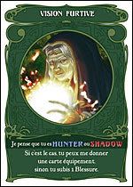
        <figcaption>  <strong>Figure 4 :</strong> Carte Vision</figcaption>
        </figure> 
- Les cartes Ténèbres doivent être dévoiler aussitôt aux autres joueurs, ces derniers sont d'avantages tournés offensif et sabotage;
         <figure style="text-align: center;">
        
        <figcaption>  <strong>Figure 5 :</strong> Carte Ténèbre</figcaption>
        </figure> 

- Les cartes Lumières doivent être dévoiler aussitôt aux autres joueurs, ces derniers sont d'avantages tournés défensif et soutien.
         <figure style="text-align: center;">
        
        <figcaption>  <strong>Figure 6 :</strong> Carte Lumière</figcaption>
        </figure> 

Parmis les cartes ténèbres et lumières, il y a deux types de cartes:
- les cartes équipements qui accompagneront le joueur tout le long de la partie.
- les cartes à utilisation immédiate

Déroulement d'une partie:
- Avant de commencer la partie, le positionnement des différents lieux est fait de manière aléatoire. 
Après cela, les joueurs ont leurs rôles attribués aléatoirement, puis ces derniers ont leurs ordre définis par un lancer de dé.
- Un tours de jeu commence par un lancer de dé pour savoir où le joueur doit aller (somme d'un d4 et d'un d6), la somme des dé indique le lieu où  le joueur doit se déplacer, un 7 lui laisse choisir mais il doit toujours changer de lieu(il n'est pas possible de rester deux fois sur le même lieu).    
Le joueur peut ensuite effectuer l'effet indiqué sur la carte lieux et, si il y a un joueur au sein de la même zone le joueur dont c'est le tour à la possibilité d'effectuer une attaque contre ce dernier.Il lance alors ces deux dé d4 et d6 et inflige au joueur attaqué la valeur absolue de la différence en blessures(si la différence est de 0 il n'inflige pas de dégats).
- La révélation peux ce faire à tout instant, même pendant le tour de l'adversaire.

Une partie peut être jouer de 4 à 8 joueurs changeant ainsi la répartition des camps
| Nombre de joueur | Nombre de Shadow | Nombre de Hunter | Nombre de Neutre |
|--------|---------|--------|---------|
| 4 | 2 | 2 | 0 |
| 5 | 2 | 2 | 1 |
| 6 | 2 | 2 | 2 |
| 7 | 2 | 2 | 3 (sauf Bob) |
| 8 | 3 | 3 | 2 (sauf Bob) |

### 1.3 Conception Logiciel
Pour la suite de la production du projet, a été décidé de partir sur le mode de jeu à 4 joueurs car ce dernier permet de rendre la première version à produire du projet plus simple car enlevant le camp Neutre, ce qui enlève de nombreuse condition de victoire différentes.

Etant donner que nous avons en notre possession le jeu, il est alors possible de scanner les différent élément du jeu afin de pouvoir les intégrers à notre code. L'ajout de cet aspect graphique est ce qui peut être produit ultérieuremnt.

## 2 Description et conception des états

L'objectif de cette section est une description très fine des états dans le projet. Plusieurs niveaux de descriptions sont attendus. Le premier doit être général, afin que le lecteur puisse comprendre les éléments et principes en jeux. Le niveau suivant est celui de la conception logicielle. Pour ce faire, on présente à la fois un diagramme des classes, ainsi qu'un commentaire détaillé de ce diagramme. Indiquer l'utilisation de patron de conception sera très apprécié. Notez bien que les règles de changement d'état ne sont pas attendues dans cette section, même s'il n'est pas interdit d'illustrer de temps à autre des états par leurs possibles changements.

### 2.1 Description des états
L'état du jeu est formé par 4 joueurs et un terrain. Le joueur 1 effectue ses différentes actions et les joueurs restants sont contrôlés par des Intelligences Artificielles (ou d'autres joueurs). Le terrain, quant à lui, affiche la position des joueurs ainsi que leurs dégâts subis, mais aussi les différents paquets de cartes.

#### 2.1.1 État du terrain
Le terrain est constitué de trois parties : une partie indiquant les points de vie où les jetons de chacun représenteront les dégâts subis par chaque joueur.
La seconde partie sera celle des lieux représentant la position des joueurs à l’instant T. Cela permet de savoir s’il y a des joueurs dans la même zone, mais aussi de connaître les effets de chaque lieu.
La troisième partie est la pioche, où il y a trois tas de cartes : vision, lumière et ténèbres.
L’attribution et l’utilisation de ces différentes parties ne sont pas contrôlées directement par le joueur mais par les résultats de lancers de dé que ce dernier effectuera. L’analyse des lancers de dé n’est pas faite par le board mais par l’engine dont nous discuterons ultérieurement.

#### 2.1.2 État du joueur
Les joueurs ont accès aux différentes informations propres à leurs rôles ainsi qu’à leurs équipements. Ils ont aussi la possibilité d’attaquer ou non un adversaire s’ils se trouvent au sein de la même zone. Le joueur a aussi la possibilité de se révéler afin de pouvoir utiliser son effet.

#### 2.1.3 État du packet de carte
Les paquets de cartes sont divisés en trois : les cartes visions qui vont apporter des informations aux joueurs concernant leurs adversaires, les cartes lumières qui donnent des effets aux joueurs et les cartes ténèbres qui font de même.

### 2.2 Conception logicielle
#### 2.2.1 Classes Player
<figure style="text-align: center;">
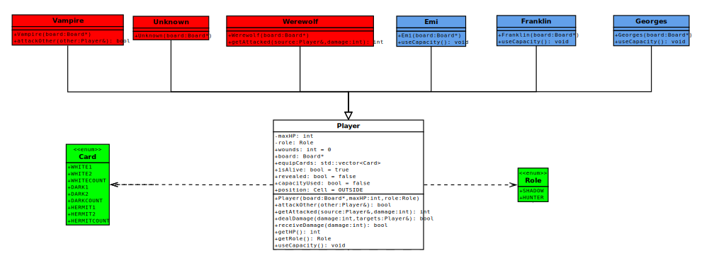
 <figcaption>  <strong>Figure 7 :</strong> Classes Player</figcaption>
</figure> 
La classe Player est ce qui va permettre de définir les différentes informations propres au statut du joueur basique, ce qui correspond à un personnage révélé. Par la suite, cette classe est héritée pour construire les différents rôles nécessitant des effets spécifiques. On peut ainsi observer sur la figure 7 les différents rôles hérités : en rouge ce sont les Shadows et en bleu les Hunters. Par la suite, il devrait potentiellement y avoir l’ajout des cartes Neutres qui auront des effets qui leur seront propres.
La classe Player est reliée à un énumérateur contenant les différents rôles existants, pour l’instant il n’y a que les rôles Shadow et Hunter.
Le Player a aussi accès aux informations sur les cartes en sa possession

| Methode | Objectif |
|--------|---------|
| Player (Board* board, int maxHP, Role role) | Constructeur, sert à initialiser le joueur avec les spécificités de son rôle |
| bool attackOther (Player& other) | Retourne si l’attaque contre l’autre joueur a été un succès |
| int getAttacked (Player& source, int damage) | Vérifie si le joueur est attaqué et retourne les dégâts subis par ce dernier |
| bool dealDamage (int damage, Player& targets) | Vérifie si le joueur visé prend les dégâts provenant de l’attaquant et retourne si la cible est toujours en vie |
| bool receiveDamage (int damage) | Attribue les dégâts subis par le joueur et retourne si ce dernier est toujours en vie |
|int getHP () | Récupère les PV max du joueur par rapport à son rôle |
|Role getRole () | Retourne le rôle du joueur |
|void useCapacity () | Effectue l’action liée à la capacité du rôle |

#### 2.2.2 Classes Board
<figure style="text-align: center;">
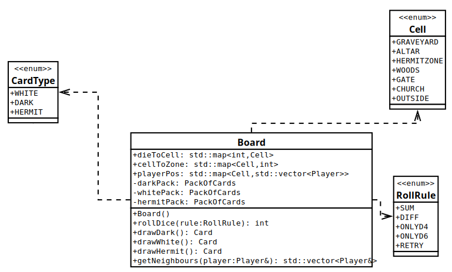
 <figcaption>  <strong>Figure 8 :</strong> Classes Board</figcaption>
</figure> 
La classe Board va faire en sorte de garder les positions des différents joueurs, mais aussi de contenir les paquets de cartes.
La classe est reliée à trois énumérations en vert : les types de cartes, les différents lieux et enfin les différents dés utilisés.

<figure style="text-align: center;">
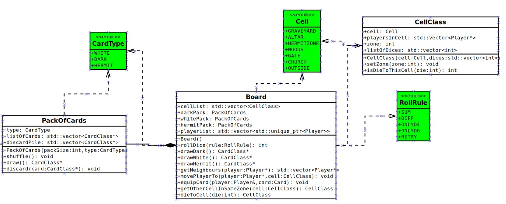
 <figcaption>  <strong>Figure 9 :</strong> Nouvelle classe Board</figcaption>
</figure> 

Les différents lieux ont été modifiés pour être maintenant des classes contenant l'enumeration des lieux mais aussi un vecteur de player contenant les joueurs sur la case,un vecteur d'int contenant les jets de dés permettant d'aller sur cette case ainsi qu'un int pour savoir dans quelle zone la case se situe.
| Methode | Objectif |
|--------|---------|
| Board() | Constructeur, sert à initialiser le board |
| int rollDice(rule:RollRule) | Lance un dé en suivant les règles établies au sein de l’énumérateur RollRule et retourne la valeur obtenue |
| Card drawDark() | Pioche une carte du paquet de cartes dark et retourne la carte |
| Card drawWhite() | Pioche une carte du paquet de cartes white et retourne la carte |
| Card drawHermite() | Pioche une carte du paquet de cartes hermite et retourne la carte |
| vector<Player*> getNeighbours(player: Player&) | Retourne une liste de joueurs voisins au Player |
| CellClass getOtherCellInSameZone(CellClass: Cell) | Retourne la cellule se trouvant dans la même zone que la cellule choisie |
|CellClass dieToCell(int die) | Retourne la cellule correspondant au jet de dés

#### 2.2.3 Classes Pack of Card
<figure style="text-align: center;">
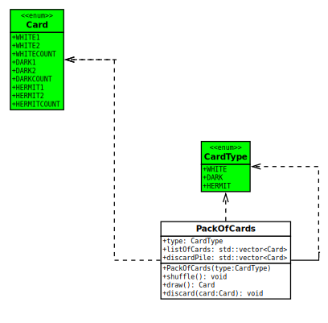
 <figcaption>  <strong>Figure 9 :</strong> Classes PackOfCards</figcaption>
</figure> 

<figure style="text-align: center;">

 <figcaption>  <strong>Figure 9 :</strong> Classes PackOfCards</figcaption>
</figure> 

La classe PackOfCard sert à la création des différents paquets de cartes.
Cette classe est reliée à deux énumérations :

- l’énumérateur type card contenant les informations propres au type de carte,
- l’énumérateur card prenant en compte les différentes spécificités propres aux cartes.
- Après reflexion dans le projet, il a été décidé de changer l'énumérateur Card en un classe CardClass contenant elle un name de type Card ainsi qu'un type de type CardType.

| Methode | Objectif |
|--------|---------|
| PackOfCards(type:CarType) | Constructeur, sert à initialiser le paquet de cartes par rapport à son type de carte |
| shuffle() | Mélange le paquet de cartes |
| CardClass draw() | Pioche une carte du paquet de cartes et retourne la carte |
| discard(card:Card) | Positionne la carte dans la discard pile |

### 2.3 Conception logicielle: extension pour le rendu
<figure style="text-align: center;">
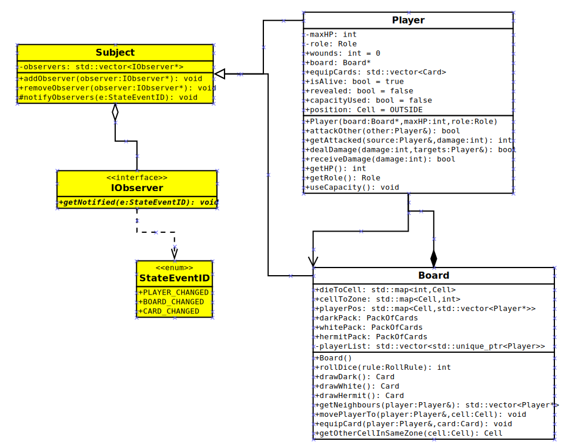
 <figcaption>  <strong>Figure 10 :</strong> State, extension pour le rendu</figcaption>
</figure> 
Le rendu doit être informé lors d'un changement du State pour afficher les modifications nécessaires. Pour cela le design pattern Observer est utilisé. Les classes Board et Player sont des sujets (Subject) connaissant tous leurs observateurs et pouvant les notifier d'un changement. Le rendu sera alors un observateur du State.

<strong>Subject</strong>
| Methode | Objectif |
|--------|---------|
| void addObserver(observer:IObserver*) | Ajoute un observateur à la liste des observateurs |
| void removeObserver(observer:IObserver*) | Retire un observateur de la liste des observateurs |
| void notifyObservers() | Notifie tous les observateurs d'un changement d'état |

<strong>IObserver</strong>
| Methode | Objectif |
|--------|---------|
| void getNotified(e:StateEventID) | Traite la notification reçue |

### 2.4 Conception logicielle: extension pour le moteur de jeu

### 2.5 Ressources

<figure style="text-align: center;">
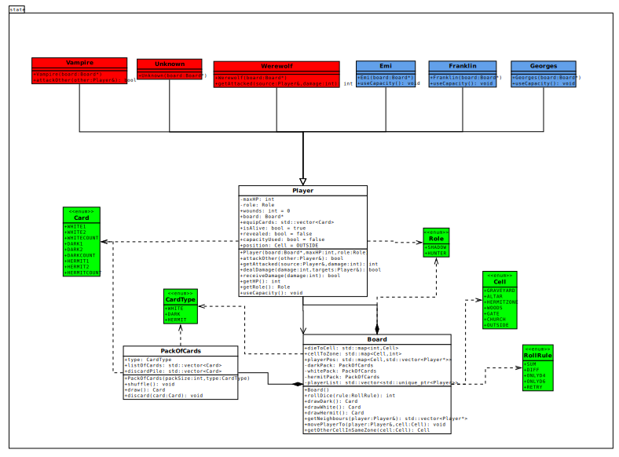
 <figcaption>  <strong>Figure 11 :</strong> Diagramme des classes d'état</figcaption>
</figure> 
On peut maintenant observer les différentes interactions entre les différents états, que ce soit entre le Player et le Board, où chacun d’entre eux a la nécessité de faire appel à l’autre pour effectuer certaines méthodes. Il en est de même pour PackOfCard et Board.

## 3 Rendu: Stratégie et Conception

### 3.1 Stratégie de rendu d'un état
Différents éléments doivent être rendus à l'écran pendant une partie de Shadowhunters. Cela inclu le plateau de jeu lui même, les cartes, les informations relatives aux joueurs. Plusieures classes sont alors créées, chacune responsable du rendu de certains éléments du jeu et de l'écoute des interactions utilisateur (clics, appuis de touches) avec ces éléments.  

Une classe RenderManager est responsable de la coordination des différents rendus. Elle est un observer du State et est notifiée à chaque changement d'état. Elle demande alors aux différentes classes de rendu de mettre à jour leur affichage en fonction des nouvelles informations du State. Elle délègue également la capture des interactions utilisateur aux classes de rendu.  

Le RenderManager est aussi en lien avec le client. Le client implémente un fonction run() qui s'exécute tant que la fenêtre de jeu est ouverte. Cette fonction appelle en boucle les méthodes handleEvent() et draw() du RenderManager. Le Client reçoit les informations des évènements utilisateur captés par le Render. Il les traite alors en fonction du type d'interaction avec des méthodes spécifiques, et modifie le State en conséquence.
Pour l'instant le Client modifie directement le State, mais lorsque l'Engine sera implémenté, le Client devra traiter les évènements captés par le Render et retranscrire cela en Commandes envoyées à l'Engine.

### 3.2 Conception logicielle

<strong>RenderManager</strong>
<figure style="text-align: center;">
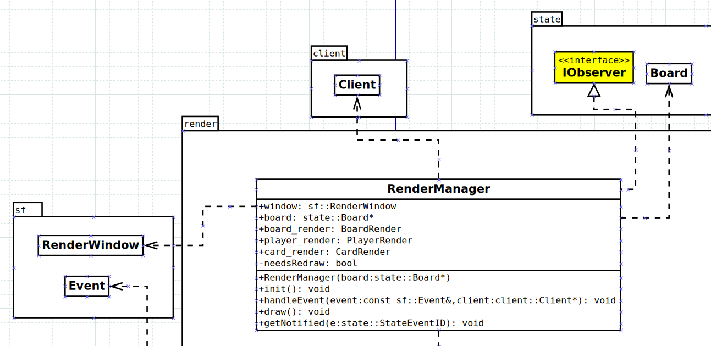
 <figcaption>  <strong>Figure 12 :</strong> Classe RenderManager</figcaption>
</figure> 

| Methode | Objectif |
|--------|---------|
| void init() | Ajoute le RenderManager à la liste des observers du State, créé la fenêtre de jeu et initialise les différentes classes de rendu |
| void handleEvent(event:const sf::Event&, client:client::Client) | Appelle les méthodes handleEvent des classes de rendu |
| void draw() | Appelle les méthodes draw() des classes de rendu si le State a été mis à jour |
| void getNotified(e:StateEventID) | Reçoit la notification d'un changement du State |

<strong>Classes de rendu</strong>
<figure style="text-align: center;">
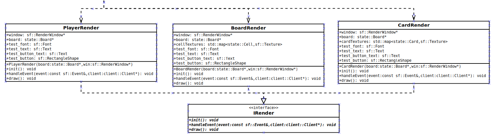
 <figcaption>  <strong>Figure 13 :</strong> Classes de Rendu</figcaption>
</figure> 

Comme dit plus haut, les différentes classes de rendu sont responsables de l'affichage de certains éléments du jeu (le plateau, les informations des joueurs, les cartes) et de la capture des interactions utilisateur avec ces éléments. Chaque classe de rendu implémente les même méthodes.

| Methode | Objectif |
|--------|---------|
| void init() | Charge les ressources à afficher |
| void handleEvent(event:const sf::Event&, client:client::Client) | Capture les évènements utilisateur (clics, appuis de touches) |
| void draw() | Dessine les éléments dans la fenêtre |

### 3.3 Conception logicielle: extension pour les animations

### 3.4 Ressources

<figure style="text-align: center;">
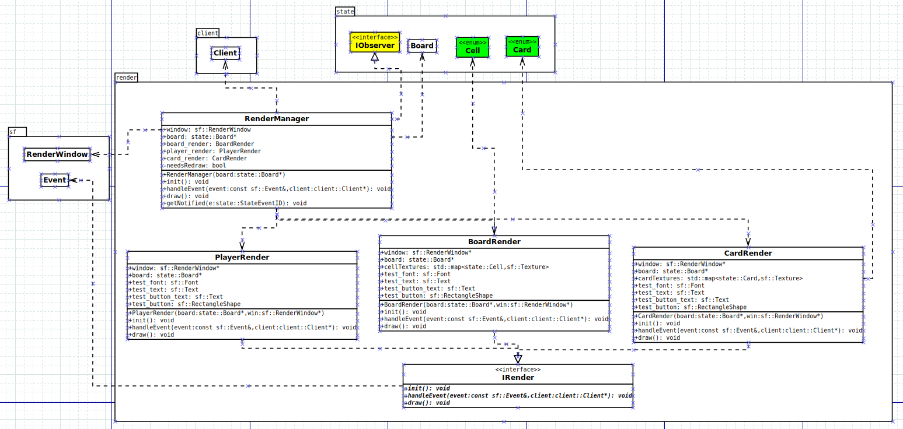
 <figcaption>  <strong>Figure 14 :</strong> Diagramme de classes de Render</figcaption>
</figure> 

<figure style="text-align: center;">
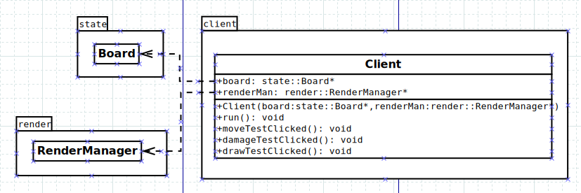
 <figcaption>  <strong>Figure 15 :</strong> Diagramme de classes de Client</figcaption>
</figure> 

<figure style="text-align: center;">
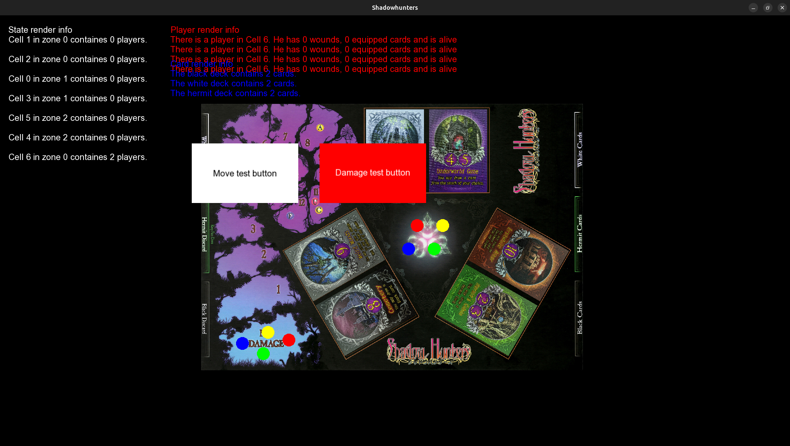
 <figcaption>  <strong>Figure 16 :</strong> Render actuel du jeu</figcaption>
</figure> 

## 4 Règles de changement d'états et moteur de jeu
Dans cette section, il faut présenter les événements qui peuvent faire passer d'un état à un autre. Il faut également décrire les aspects liés au temps, comme la chronologie des événements et les aspects de synchronisation. Une fois ceci présenté, on propose une conception logicielle pour pouvoir mettre en œuvre ces règles, autrement dit le moteur de jeu.

### 4.1 Horloge globale

### 4.2 Changements extérieurs

### 4.3 Changements autonomes

### 4.4 Conception logicielle

### 4.5 Conception logicielle: extension pour l'IA

### 4.6 Conception logicielle: extension pour la parallélisation

Illustration 3: Diagrammes des classes pour le moteur de jeu

## 5 Intelligence Artificielle
Cette section est dédiée aux stratégies et outils développés pour créer un joueur artificiel. Ce robot doit utiliser les mêmes commandes qu'un joueur humain, ie utiliser les mêmes actions/ordres que ceux produit par le clavier ou la souris. Le robot ne doit pas avoir accès à plus information qu'un joueur humain. Comme pour les autres sections, commencez par présenter la stratégie, puis la conception logicielle.
### 5.1 Stratégies

#### 5.1.1 Intelligence minimale

#### 5.1.2 Intelligence basée sur des heuristiques

#### 5.1.3 Intelligence basée sur les arbres de recherche

### 5.2 Conception logicielle

### 5.3 Conception logicielle: extension pour l'IA composée

### 5.4 Conception logicielle: extension pour IA avancée

### 5.5 Conception logicielle: extension pour la parallélisation

## 6 Modularisation
Cette section se concentre sur la répartition des différents modules du jeu dans différents processus. Deux niveaux doivent être considérés. Le premier est la répartition des modules sur différents threads. Notons bien que ce qui est attendu est un parallélisation maximale des traitements: il faut bien démontrer que l'intersection des processus communs ou bloquant est minimale. Le deuxième niveau est la répartition des modules sur différentes machines, via une interface réseau. Dans tous les cas, motivez vos choix, et indiquez également les latences qui en résulte.

### 6.1 Organisation des modules

#### 6.1.1 Répartition sur différents threads

#### 6.1.2 Répartition sur différentes machines

### 6.2 Conception logiciel

### 6.3 Conception logiciel: extension réseau

### 6.4 Conception logiciel: client Android

Illustration 4: Diagramme de classes pour la modularisation

