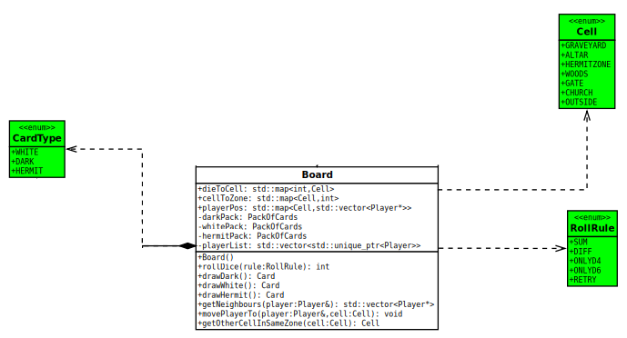

<div style="text-align: justify;">

# Projet Logiciel Transversal

---

#### Prénom NOM
> Clovis    – Pressard  
> Nathan    – Groussard  
> Maël      – Lukas  
> Léo       – Boutonnet  
---

## État d'avancement du projet (Janvier 2026)

Au cours des trois derniers mois, des avancées significatives ont été réalisées sur le projet Shadow Hunters :

### Modules complètement implémentés

**1. Module State (État du jeu)** 
- Toutes les classes d'état sont fonctionnelles : Board, Player, PackOfCards, CellClass, CardClass
- 6 personnages jouables avec capacités spécifiques : Werewolf, Vampire, Unknown (Shadow) et Franklin, Georges, Emi (Hunter)
- Système de cartes avec 3 types : Dark, White, Hermit
- Pattern Observer implémenté pour notifier le rendu des changements d'état
- Tests unitaires complets validant le comportement

**2. Module Engine (Moteur de jeu)** 
- Architecture basée sur le pattern Command
- Système de phases de tour : MOVE_PHASE, CELL_EFFECT_PHASE, BATTLE_PHASE
- 25+ commandes implémentées couvrant toutes les actions de jeu
- Gestion automatique des tours et vérification des conditions de victoire
- Factories pour les effets de cellules et de cartes
- Système de prompts pour les interactions joueur

**3. Module Render (Rendu graphique)** 
- Rendu complet avec SFML : plateau, joueurs, cartes, UI
- RenderManager coordonnant 5 sous-rendus spécialisés
- Affichage contextuel selon la phase de jeu
- Système de prompts graphiques pour les choix
- Écran de fin de partie
- Textures scannées du jeu physique intégrées

**4. Module Client** 
- Boucle de jeu principale fonctionnelle
- Capture des événements utilisateur (clics, touches)
- Traduction des interactions en commandes pour l'Engine
- Gestion des prompts et réponses utilisateur

### Fonctionnalités jouables

Le jeu est actuellement jouable en mode local avec :
- Partie à 4 joueurs (2 Shadows vs 2 Hunters)
- Déplacement avec lancer de dés
- Effets de 6 lieux différents (Gate, Woods, Church, Graveyard, Hermit, Altar)
- Combat entre joueurs
- Système de cartes Dark et White avec effets variés
- Capacités spéciales des personnages
- Révélation stratégique
- Conditions de victoire fonctionnelles

### En cours de développement

- Intelligence Artificielle (architecture prévue, non implémentée)
- Mode réseau (architecture préparée pour l'extension)

### Architecture technique

- **Langage** : C++
- **Bibliothèques** : SFML (graphique), Boost (tests)
- **Build system** : CMake
- **Patterns utilisés** : Command, Observer, Factory, Strategy (prévu pour IA)
- **Tests** : Tests unitaires avec Boost.Test

---

## Sommaire

- [Projet Logiciel Transversal](#projet-logiciel-transversal)
      - [Prénom NOM](#prénom-nom)
  - [État d'avancement du projet (Janvier 2026)](#état-davancement-du-projet-janvier-2026)
    - [Modules complètement implémentés](#modules-complètement-implémentés)
    - [Fonctionnalités jouables](#fonctionnalités-jouables)
    - [En cours de développement](#en-cours-de-développement)
    - [Architecture technique](#architecture-technique)
  - [Sommaire](#sommaire)
  - [1 Objectif](#1-objectif)
    - [1.1 Présentation générale](#11-présentation-générale)
    - [1.2 Règles du jeu](#12-règles-du-jeu)
    - [1.3 Conception Logiciel](#13-conception-logiciel)
  - [2 Description et conception des états](#2-description-et-conception-des-états)
    - [2.1 Description des états](#21-description-des-états)
      - [2.1.1 État du terrain](#211-état-du-terrain)
      - [2.1.2 État du joueur](#212-état-du-joueur)
      - [2.1.3 État du packet de carte](#213-état-du-packet-de-carte)
    - [2.2 Conception logicielle](#22-conception-logicielle)
      - [2.2.1 Classes Player](#221-classes-player)
      - [2.2.2 Classes Board](#222-classes-board)
      - [2.2.3 Classes Pack of Card](#223-classes-pack-of-card)
    - [2.3 Conception logicielle: extension pour le rendu](#23-conception-logicielle-extension-pour-le-rendu)
    - [2.4 Conception logicielle: extension pour le moteur de jeu](#24-conception-logicielle-extension-pour-le-moteur-de-jeu)
    - [2.5 Ressources](#25-ressources)
  - [3 Rendu: Stratégie et Conception](#3-rendu-stratégie-et-conception)
    - [3.1 Stratégie de rendu d'un état](#31-stratégie-de-rendu-dun-état)
    - [3.2 Conception logicielle](#32-conception-logicielle)
    - [3.3 Conception logicielle: extension pour les animations](#33-conception-logicielle-extension-pour-les-animations)
    - [3.4 Ressources](#34-ressources)
  - [4 Règles de changement d'états et moteur de jeu](#4-règles-de-changement-détats-et-moteur-de-jeu)
    - [4.1 Horloge globale](#41-horloge-globale)
    - [4.2 Changements extérieurs](#42-changements-extérieurs)
    - [4.3 Changements autonomes](#43-changements-autonomes)
    - [4.4 Conception logicielle](#44-conception-logicielle)
    - [4.5 Conception logicielle: extension pour l'IA](#45-conception-logicielle-extension-pour-lia)
    - [4.6 Conception logicielle: extension pour la parallélisation](#46-conception-logicielle-extension-pour-la-parallélisation)
  - [5 Intelligence Artificielle](#5-intelligence-artificielle)
    - [5.1 Stratégies](#51-stratégies)
      - [5.1.1 Intelligence minimale](#511-intelligence-minimale)
      - [5.1.2 Intelligence basée sur des heuristiques](#512-intelligence-basée-sur-des-heuristiques)
      - [5.1.3 Intelligence basée sur les arbres de recherche](#513-intelligence-basée-sur-les-arbres-de-recherche)
    - [5.2 Conception logicielle](#52-conception-logicielle)
    - [5.3 Conception logicielle: extension pour l'IA composée](#53-conception-logicielle-extension-pour-lia-composée)
    - [5.4 Conception logicielle: extension pour IA avancée](#54-conception-logicielle-extension-pour-ia-avancée)
    - [5.5 Conception logicielle: extension pour la parallélisation](#55-conception-logicielle-extension-pour-la-parallélisation)
  - [6 Modularisation](#6-modularisation)
    - [6.1 Organisation des modules](#61-organisation-des-modules)
      - [6.1.1 Répartition sur différents threads](#611-répartition-sur-différents-threads)
      - [6.1.2 Répartition sur différentes machines](#612-répartition-sur-différentes-machines)
    - [6.2 Conception logiciel](#62-conception-logiciel)
    - [6.3 Conception logiciel: extension réseau](#63-conception-logiciel-extension-réseau)
    - [6.4 Conception logiciel: client Android](#64-conception-logiciel-client-android)

## 1 Objectif

### 1.1 Présentation générale

Durant ce projet, l'objectif est de reproduire le jeu Shadow Hunter. Shadow Hunter est un jeu de plateau, développé par Yasutaka Ikeda, c'est un jeu de bluff où le but est de faire gagner son camp, que ce soit les Hunter, Shadow ou les personnages neutres. Pour ce faire, le joueur devra réussir à déterminer qui sont ses alliés et qui sont ses ennemis. Ce jeu, à travers sa partie bluff, peut faire penser au jeu du loup-garou mais la comparaison en reste là, car contrairement à ce dernier qui tourne autour des débats, Shadow Hunter introduit des mécaniques bien différentes, que ce soit par la possibilité de combattre avec les joueurs, l'attribution de différents rôles, l'utilisation de cartes d’équipement et à effet immédiat. Cela apporte ainsi de nouveaux niveaux de complexité dans l'obtention de la victoire.
Le plateau de jeu peut être vu en Figure 1.


<br><figure style="text-align: center;">
  
  <br></br><figcaption><strong>Figure 1 :</strong> Shadow Hunter</figcaption>
</figure></br>

Exemple de rendue d'une partie:
<br><figure style="text-align: center;">
  
  <br></br><figcaption><strong>Figure 2 :</strong> Représentation d'une partie</figcaption>
</figure></br>


### 1.2 Règles du jeu

Le jeu est divisé en trois camp:

- les Shadows ayant pour but d'éliminer les groupes adverses
- les Hunters ont le même but que les Shadows
- les Neutres ont des conditions de victoire propre au rôle du joueur  

Dans les camps chaque rôle à un effet qui lui est propre et qui peut être utilisé uniquement après que ce dernier ce soit révêler. Les effets peuvent être utilisable qu'une seule fois par tour ou une unique fois par partie.

Le plateau visible à la Figure 3 trois parties :

- une partie à gauche contenant les points de vie ainsi que les informations à propos des points de vie max des différents rôles ;
- une partie au milieu contenant les cartes des différentes zones et lieux ;
- une partie à droite contenant les cartes effets (les cartes Ténèbres, les cartes Lumières et les cartes Vision)

<br><figure style="text-align: center;">
  
  <figcaption><br></br><strong>Figure 3 :</strong> Plateau de jeu</figcaption>
</figure></br>

Les cartes effets sont divisé en trois:

- Les cartes vision qui ont pour but de donner une information sur le camps du joueur ciblé;
        <br><figure style="text-align: center;">
        
        <figcaption><br></br><strong>Figure 4 :</strong> Carte Vision</figcaption>
        </figure></br>
- Les cartes Ténèbres doivent être dévoiler aussitôt aux autres joueurs, ces derniers sont d'avantages tournés offensif et sabotage;
        <br><figure style="text-align: center;">
        
        <figcaption><br></br><strong>Figure 5 :</strong> Carte Ténèbre</figcaption>
        </figure></br>

- Les cartes Lumières doivent être dévoiler aussitôt aux autres joueurs, ces derniers sont d'avantages tournés défensif et soutien.
        <br><figure style="text-align: center;">
        
        <figcaption><br></br><strong>Figure 6 :</strong> Carte Lumière</figcaption>
        </figure></br>

Parmis les cartes ténèbres et lumières, il y a deux types de cartes:

- les cartes équipements qui accompagneront le joueur tout le long de la partie.
- les cartes à utilisation immédiate

Déroulement d'une partie:

- Avant de commencer la partie, le positionnement des différents lieux est fait de manière aléatoire. 
Après cela, les joueurs ont leurs rôles attribués aléatoirement, puis ces derniers ont leurs ordre définis par un lancer de dé.
- Un tours de jeu commence par un lancer de dé pour savoir où le joueur doit aller (somme d'un d4 et d'un d6), la somme des dé indique le lieu où  le joueur doit se déplacer, un 7 lui laisse choisir mais il doit toujours changer de lieu(il n'est pas possible de rester deux fois sur le même lieu).    
Le joueur peut ensuite effectuer l'effet indiqué sur la carte lieux et, si il y a un joueur au sein de la même zone le joueur dont c'est le tour à la possibilité d'effectuer une attaque contre ce dernier.Il lance alors ces deux dé d4 et d6 et inflige au joueur attaqué la valeur absolue de la différence en blessures(si la différence est de 0 il n'inflige pas de dégats).
- La révélation peux ce faire à tout instant, même pendant le tour de l'adversaire.

Une partie peut être jouer de 4 à 8 joueurs changeant ainsi la répartition des camps

| Nombre de joueur | Nombre de Shadow | Nombre de Hunter | Nombre de Neutre |
|--------|---------|--------|---------|
| 4 | 2 | 2 | 0 |
| 5 | 2 | 2 | 1 |
| 6 | 2 | 2 | 2 |
| 7 | 2 | 2 | 3 (sauf Bob) |
| 8 | 3 | 3 | 2 (sauf Bob) |


### 1.3 Conception Logiciel

Pour la suite de la production du projet, a été décidé de partir sur le mode de jeu à 4 joueurs car ce dernier permet de rendre la première version à produire du projet plus simple car enlevant le camp Neutre, ce qui enlève de nombreuse condition de victoire différentes.

Etant donner que nous avons en notre possession le jeu, il est alors possible de scanner les différent élément du jeu afin de pouvoir les intégrers à notre code. L'ajout de cet aspect graphique est ce qui peut être produit ultérieuremnt.


## 2 Description et conception des états

L'objectif de cette section est une description très fine des états dans le projet. Plusieurs niveaux de descriptions sont attendus. Le premier doit être général, afin que le lecteur puisse comprendre les éléments et principes en jeux. Le niveau suivant est celui de la conception logicielle. Pour ce faire, on présente à la fois un diagramme des classes, ainsi qu'un commentaire détaillé de ce diagramme. Indiquer l'utilisation de patron de conception sera très apprécié. Notez bien que les règles de changement d'état ne sont pas attendues dans cette section, même s'il n'est pas interdit d'illustrer de temps à autre des états par leurs possibles changements.

### 2.1 Description des états

L'état du jeu est formé par 4 joueurs et un terrain. Le joueur 1 effectue ses différentes actions et les joueurs restants sont contrôlés par des Intelligences Artificielles (ou d'autres joueurs). Le terrain, quant à lui, affiche la position des joueurs ainsi que leurs dégâts subis, mais aussi les différents paquets de cartes.

#### 2.1.1 État du terrain

Le terrain est constitué de trois parties : une partie indiquant les points de vie où les jetons de chacun représenteront les dégâts subis par chaque joueur.
La seconde partie sera celle des lieux représentant la position des joueurs à l’instant T. Cela permet de savoir s’il y a des joueurs dans la même zone, mais aussi de connaître les effets de chaque lieu.
La troisième partie est la pioche, où il y a trois tas de cartes : vision, lumière et ténèbres.
L’attribution et l’utilisation de ces différentes parties ne sont pas contrôlées directement par le joueur mais par les résultats de lancers de dé que ce dernier effectuera. L’analyse des lancers de dé n’est pas faite par le board mais par l’engine dont nous discuterons ultérieurement.

#### 2.1.2 État du joueur

Les joueurs ont accès aux différentes informations propres à leurs rôles ainsi qu’à leurs équipements. Ils ont aussi la possibilité d’attaquer ou non un adversaire s’ils se trouvent au sein de la même zone. Le joueur a aussi la possibilité de se révéler afin de pouvoir utiliser son effet.

#### 2.1.3 État du packet de carte

Les paquets de cartes sont divisés en trois : les cartes visions qui vont apporter des informations aux joueurs concernant leurs adversaires, les cartes lumières qui donnent des effets aux joueurs et les cartes ténèbres qui font de même.

### 2.2 Conception logicielle

#### 2.2.1 Classes Player

<figure style="text-align: center;">

<br><figcaption><br></br><strong>Figure 7 :</strong> Classes Player</figcaption>
</figure></br>

<figure style="text-align: center;">

<br><figcaption><br></br><strong>Figure 7 :</strong> Nouvelles classes Player</figcaption>
</figure></br>

La classe Player est ce qui va permettre de définir les différentes informations propres au statut du joueur basique, ce qui correspond à un personnage révélé. Par la suite, cette classe est héritée pour construire les différents rôles nécessitant des effets spécifiques. On peut ainsi observer sur la figure 7 les différents rôles hérités : en rouge ce sont les Shadows et en bleu les Hunters. Par la suite, il devrait potentiellement y avoir l’ajout des cartes Neutres qui auront des effets qui leur seront propres.
La classe Player est reliée à un énumérateur contenant les différents rôles existants. Les rôles Shadow et Hunter sont implémentés, et 4 personnages avec leurs capacités spécifiques sont disponibles :

**Personnages Shadow :**

- **Werewolf (Loup-garou)** : 14 PV, sa capacité permet de contrer les attaques
- **Vampire** : 13 PV, récupère des PV en attaquant quand révélé

**Personnages Hunter :**

- **Franklin** : 12 PV, capacité spéciale implémentée via FranklinCapacityCommand
- **Georges** : 14 PV, capacité spéciale implémentée via GeorgesCapacityCommand

Le Player a aussi accès aux informations sur les cartes en sa possession via l'attribut `equipCards`

| Methode | Objectif |
|--------|---------|
| Player (Board* board, int maxHP, Role role, CharacterName name) | Constructeur, sert à initialiser le joueur avec les spécificités de son rôle et son nom |
| virtual bool attackOther (Player& other) | Retourne si l'attaque contre l'autre joueur a été un succès (virtuelle pour permettre les capacités spéciales comme celle du Vampire) |
| virtual int getAttacked (Player& source, int damage) | Vérifie si le joueur est attaqué et retourne les dégâts subis par ce dernier |
| bool dealDamage (int damage, Player& targets) | Vérifie si le joueur visé prend les dégâts provenant de l'attaquant et retourne si la cible est toujours en vie |
| bool receiveDamage (int damage) | Attribue les dégâts subis par le joueur et retourne si ce dernier est toujours en vie (peut soigner si négatif) |
| int getHP () | Récupère les PV max du joueur par rapport à son rôle |
| Role getRole () | Retourne le rôle du joueur |
| virtual void useCapacity () | Effectue l'action liée à la capacité du rôle (virtuelle pour chaque personnage) |
| void equipACard (CardClass* card) | Équipe une carte au joueur |
| void revealYourself () | Révèle l'identité du joueur |


#### 2.2.2 Classes Board

<figure style="text-align: center;">

<br><figcaption><br></br><strong>Figure 8 :</strong> Classes Board</figcaption>
</figure></br>
La classe Board va faire en sorte de garder les positions des différents joueurs, mais aussi de contenir les paquets de cartes.
La classe est reliée à trois énumérations en vert : les types de cartes, les différents lieux et enfin les différents dés utilisés.

<figure style="text-align: center;">

<br><figcaption><br></br><strong>Figure 8 V2 :</strong> Nouvelle classe Board (Novembre)</figcaption>
</figure></br>

<figure style="text-align: center;">

<br><figcaption><br></br><strong>Figure 8 V3 :</strong> Nouvelle classe Board(Janvier)</figcaption>
</figure></br>

Les différents lieux ont été modifiés pour être maintenant des classes contenant l'enumeration des lieux mais aussi un vecteur de player contenant les joueurs sur la case,un vecteur d'int contenant les jets de dés permettant d'aller sur cette case ainsi qu'un int pour savoir dans quelle zone la case se situe.

| Methode | Objectif |
|--------|---------|
| Board() | Constructeur, initialise le plateau avec les 4 joueurs (Werewolf, Vampire, Franklin, Georges) positionnés à OUTSIDE |
| int rollDice(RollRule rule) | Lance un ou deux dés selon les règles (SUM pour d4+d6, DIFF pour leur différence absolue) |
| CardClass* drawDark() | Pioche une carte du paquet de cartes dark et retourne la carte |
| CardClass* drawWhite() | Pioche une carte du paquet de cartes white et retourne la carte |
| CardClass* drawHermit() | Pioche une carte du paquet de cartes hermit et retourne la carte |
| std::vector<Player*> getNeighbours(Player* player) | Retourne une liste de joueurs dans la même cellule que le joueur |
| CellClass* getOtherCellInSameZone(CellClass* cell) | Retourne l'autre cellule se trouvant dans la même zone |
| CellClass* dieToCell(int die) | Convertit le résultat d'un jet de dés en cellule correspondante |
| void movePlayerTo(Player* player, CellClass* cell) | Déplace un joueur vers une cellule spécifique |
| void equipCard(Player& player, CardClass* card) | Équipe une carte à un joueur |
| void defineGameOrder(std::vector<std::unique_ptr<Player>>& playerList) | Définit l'ordre de jeu des joueurs aléatoirement |
| void discardCard(CardClass* card) | Défausse une carte dans la pile de défausse appropriée |

#### 2.2.3 Classes Pack of Card

<figure style="text-align: center;">

<br><figcaption><br></br><strong>Figure 9 :</strong> Classes PackOfCards</figcaption>
</figure></br>

<figure style="text-align: center;">

<br><figcaption><br></br><strong>Figure 9 V2:</strong> Classes PackOfCards</figcaption>
</figure></br>

<figure style="text-align: center;">

<br><figcaption><br></br><strong>Figure 9 V2:</strong> Classes PackOfCards</figcaption>
</figure></br>

La classe PackOfCard sert à la création des différents paquets de cartes.
Cette classe est reliée à deux énumérations :

- l’énumérateur type card contenant les informations propres au type de carte,
- l’énumérateur card prenant en compte les différentes spécificités propres aux cartes.
- Après reflexion dans le projet, il a été décidé de changer l'énumérateur Card en un classe CardClass contenant elle un name de type Card ainsi qu'un type de type CardType.

| Methode | Objectif |
|--------|---------|
| PackOfCards(int nbCards, CardType type) | Constructeur, initialise le paquet avec un nombre de cartes et un type (DARK, WHITE, HERMIT) |
| void shuffle() | Mélange le paquet de cartes |
| CardClass* draw() | Pioche une carte du paquet ; si vide, remélange la défausse dans le paquet |
| void discard(CardClass* card) | Place la carte dans la pile de défausse |


### 2.3 Conception logicielle: extension pour le rendu

<figure style="text-align: center;">

<br><figcaption><br></br><strong>Figure 10 :</strong> State, extension pour le rendu</figcaption>
</figure></br>
Le rendu doit être informé lors d'un changement du State pour afficher les modifications nécessaires. Pour cela le design pattern Observer est utilisé. Les classes Board et Player sont des sujets (Subject) connaissant tous leurs observateurs et pouvant les notifier d'un changement. Le rendu sera alors un observateur du State.

<strong>Subject</strong>

| Methode | Objectif |
|--------|---------|
| void addObserver(observer:IObserver*) | Ajoute un observateur à la liste des observateurs |
| void removeObserver(observer:IObserver*) | Retire un observateur de la liste des observateurs |
| void notifyObservers() | Notifie tous les observateurs d'un changement d'état |

<strong>IObserver</strong>

| Methode | Objectif |
|--------|---------|
| void getNotified(e:StateEventID) | Traite la notification reçue |

### 2.4 Conception logicielle: extension pour le moteur de jeu

### 2.5 Ressources

<figure style="text-align: center;">

<br><figcaption><br></br><strong>Figure 11 :</strong> Diagramme des classes d'état</figcaption>
</figure></br>

<figure style="text-align: center;">

<br><figcaption><br></br><strong>Figure 11 :</strong> Diagramme des classes d'état</figcaption>
</figure></br>

On peut maintenant observer les différentes interactions entre les différents états, que ce soit entre le Player et le Board, où chacun d’entre eux a la nécessité de faire appel à l’autre pour effectuer certaines méthodes. Il en est de même pour PackOfCard et Board.


## 3 Rendu: Stratégie et Conception

### 3.1 Stratégie de rendu d'un état

Différents éléments doivent être rendus à l'écran pendant une partie de Shadowhunters. Cela inclu le plateau de jeu lui même, les cartes, les informations relatives aux joueurs. Plusieures classes sont alors créées, chacune responsable du rendu de certains éléments du jeu et de l'écoute des interactions utilisateur (clics, appuis de touches) avec ces éléments.  

Une classe RenderManager est responsable de la coordination des différents rendus. Elle est un observer du State et est notifiée à chaque changement d'état. Elle demande alors aux différentes classes de rendu de mettre à jour leur affichage en fonction des nouvelles informations du State. Elle délègue également la capture des interactions utilisateur aux classes de rendu.  

Le RenderManager est aussi en lien avec le client. Le client implémente un fonction run() qui s'exécute tant que la fenêtre de jeu est ouverte. Cette fonction appelle en boucle les méthodes handleEvent() et draw() du RenderManager. Le Client reçoit les informations des évènements utilisateur captés par le Render. Il les traite alors en fonction du type d'interaction avec des méthodes spécifiques, et modifie le State en conséquence.
Pour l'instant le Client modifie directement le State, mais lorsque l'Engine sera implémenté, le Client devra traiter les évènements captés par le Render et retranscrire cela en Commandes envoyées à l'Engine.

### 3.2 Conception logicielle

<strong>RenderManager</strong>
<figure style="text-align: center;">

<br><figcaption><br></br><strong>Figure 12 :</strong> Classe RenderManager</figcaption>
</figure></br>

<figure style="text-align: center;">

<br><figcaption><br></br><strong>Figure 12 :</strong> Nouvelle Classe RenderManager</figcaption>
</figure></br>

| Methode | Objectif |
|--------|---------|
| void init() | Ajoute le RenderManager à la liste des observers du State, créé la fenêtre de jeu et initialise les différentes classes de rendu |
| void handleEvent(event:const sf::Event&, client:client::Client) | Appelle les méthodes handleEvent des classes de rendu |
| void draw() | Appelle les méthodes draw() des classes de rendu si le State a été mis à jour |
| void getNotified(e:StateEventID) | Reçoit la notification d'un changement du State |

<strong>Classes de rendu</strong>
<figure style="text-align: center;">

<br><figcaption><br></br><strong>Figure 13 :</strong> Classes de Rendu</figcaption>
</figure></br>

Comme dit plus haut, les différentes classes de rendu sont responsables de l'affichage de certains éléments du jeu (le plateau, les informations des joueurs, les cartes) et de la capture des interactions utilisateur avec ces éléments. Chaque classe de rendu implémente les même méthodes.

| Methode | Objectif |
|--------|---------|
| void init() | Charge les ressources à afficher |
| void handleEvent(event:const sf::Event&, client:client::Client) | Capture les évènements utilisateur (clics, appuis de touches) |
| void draw() | Dessine les éléments dans la fenêtre |


### 3.3 Conception logicielle: extension pour les animations

### 3.4 Ressources

<figure style="text-align: center;">

<br><figcaption><br></br><strong>Figure 14 :</strong> Diagramme de classes de Render</figcaption>
</figure></br>

<figure style="text-align: center;">

<br><figcaption><br></br><strong>Figure 14 :</strong> Diagramme de classes de Render V2</figcaption>
</figure></br>

<figure style="text-align: center;">

<br><figcaption><br></br><strong>Figure 15 :</strong> Diagramme de classes de Client</figcaption>
</figure></br>

<figure style="text-align: center;">

<br><figcaption><br></br><strong>Figure 16 :</strong> Render actuel du jeu</figcaption>
</figure></br>

<figure style="text-align: center;">

<br><figcaption><br></br><strong>Figure 16 :</strong> Render actuel du jeu</figcaption>
</figure></br>


<figure style="text-align: center;">

<br><figcaption><br></br><strong>Figure 17 :</strong> Render futur du jeu</figcaption>
</figure></br>

**État actuel du rendu :**

Le rendu graphique est pleinement fonctionnel avec SFML. Les éléments suivants sont affichés :

- **Plateau de jeu** : Les 6 cellules organisées en 3 zones de 2 cellules chacune
- **Joueurs** : Représentation visuelle des 4 joueurs avec leurs positions sur le plateau
- **Points de vie** : Affichage des dégâts (wounds) pour chaque joueur
- **Cartes** : Visualisation des cartes piochées et des cartes équipées
- **Boutons d'action** : Interface utilisateur avec boutons contextuels selon la phase de jeu :
  - Bouton "Move" en MOVE_PHASE
  - Bouton "Cell Effect" en CELL_EFFECT_PHASE
  - Bouton "Attack" en BATTLE_PHASE
  - Boutons "Reveal" et "Capacity" disponibles à tout moment
- **Prompts** : Fenêtres de dialogue pour les choix du joueur (choix de cible d'attaque, choix de carte, etc.)
- **Écran de fin de partie** : Affichage du vainqueur (Hunters Win / Shadows Win / Draw)

Le système d'Observer permet une mise à jour automatique de l'affichage lorsque l'état du jeu change. Le RenderManager coordonne tous les sous-rendus et est notifié des changements via l'interface IObserver.

**Textures utilisées :**

Les textures scannées du jeu physique sont stockées dans le dossier `res/sh_card_textures/` avec plusieurs sous-dossiers :
- `sh_cards/` : Cartes de jeu
- `sh_characters/` : Portraits des personnages
- `sh_area/` : Zones du plateau
- `sh_backs/` : Dos des cartes
- etc.

Le rendu continue d'évoluer au cours du projet mais est déjà très proche de l'objectif final représenté en Figure 17.


## 4 Règles de changement d'états et moteur de jeu

Dans cette section, il faut présenter les événements qui peuvent faire passer d'un état à un autre. Il faut également décrire les aspects liés au temps, comme la chronologie des événements et les aspects de synchronisation. Une fois ceci présenté, on propose une conception logicielle pour pouvoir mettre en œuvre ces règles, autrement dit le moteur de jeu.

### 4.1 Horloge globale

Le moteur de jeu utilise une horloge basée sur les phases de tour (TurnPhase) pour organiser le déroulement d'une partie. Chaque tour est divisé en plusieurs phases :

- **MOVE_PHASE** : Phase de déplacement du joueur
- **CELL_EFFECT_PHASE** : Phase d'effet de la cellule où le joueur se trouve
- **BATTLE_PHASE** : Phase de combat potentiel avec les joueurs dans la même zone

Le moteur traite les commandes de manière séquentielle à travers la méthode `processOneCommand()` qui est appelée dans la boucle principale du jeu. Cette approche permet de synchroniser les animations et les effets visuels avec les changements d'état.

### 4.2 Changements extérieurs

Les changements extérieurs proviennent des interactions du joueur avec l'interface graphique. Le Client capture les événements (clics de souris) et les transforme en commandes pour l'Engine :

- **Déplacement** : Lorsque le joueur clique sur le bouton "Move", une MoveCommand est créée
- **Attaque** : Si un joueur clique sur "Attack", une AttackCommand est générée avec le choix de la cible
- **Révélation** : Le joueur peut se révéler à tout moment via RevealCommand
- **Utilisation de capacité** : Les capacités spéciales (FranklinCapacityCommand, GeorgesCapacityCommand) sont activées par des clics
- **Effets de cellule** : Les effets des lieux (GateCommand, WoodsCommand, StealEquipCommand) sont déclenchés automatiquement mais peuvent nécessiter des choix du joueur

Ces commandes sont ajoutées à la file de commandes de l'Engine et exécutées séquentiellement.

### 4.3 Changements autonomes

Certains changements se produisent de manière autonome sans intervention directe du joueur :

- **Passage au joueur suivant** : La méthode `goToNextPlayer()` fait automatiquement passer au joueur suivant après la phase de combat
- **Vérification de victoire** : `checkForVictory()` est appelée automatiquement à chaque fin de tour pour vérifier si un camp a gagné
- **Effets de cartes** : Certaines cartes ont des effets automatiques (ex: WhiteFlareCommand inflige 2 dégâts à tous les autres joueurs)
- **Gestion des cartes équipement temporaires** : Les cartes avec `effectTimer = ONELOOP` sont automatiquement défaussées lors du passage au tour suivant
- **Lancer de dés** : Le lancer de dés pour le déplacement se fait automatiquement, sauf résultat de 7 où le joueur choisit sa destination

### 4.4 Conception logicielle

Le moteur de jeu utilise le **pattern Command** pour encapsuler toutes les actions du jeu. Ce design pattern permet de :

- Enregistrer l'historique des actions
- Annuler/refaire des actions (fonctionnalité future)
- Sérialiser les commandes pour le réseau (fonctionnalité future)

<strong>Classe Engine</strong>

| Attribut | Type | Description |
|----------|------|-------------|
| board | state::Board* | Référence au plateau de jeu |
| commands | std::vector<Command*> | File de commandes à exécuter |
| cellEffectsFactory | std::map | Factory pour créer les commandes d'effets de cellule |
| cardEffectsFactory | std::map | Factory pour créer les commandes d'effets de carte |
| currentTurnPhase | TurnPhase | Phase actuelle du tour |
| currentGameState | GameState | État de la partie (ONGOING, HUNTERS_WIN, SHADOWS_WIN, DRAW) |
| currentPlayerIndex | int | Index du joueur actuel |
| waitingCommand | IPromptableCommand* | Commande en attente de réponse du joueur |

| Méthode | Objectif |
|---------|----------|
| Engine(state::Board* board) | Constructeur, initialise les factories de commandes |
| state::Player& getCurrentPlayer() | Retourne le joueur dont c'est le tour |
| void goToNextPlayer() | Passe au joueur suivant et nettoie les cartes temporaires |
| void processOneCommand() | Traite une commande de la file |
| void checkForVictory() | Vérifie les conditions de victoire |

<strong>Classe Command (abstraite)</strong>

| Attribut | Type | Description |
|----------|------|-------------|
| isDone | bool | Indique si la commande est terminée |

| Méthode | Objectif |
|---------|----------|
| virtual void execute() | Exécute la commande (méthode abstraite) |

<strong>Interface IPromptableCommand</strong>

Certaines commandes nécessitent une interaction avec le joueur (choix d'une cible, choix d'une carte, etc.). Ces commandes implémentent l'interface IPromptableCommand :

| Méthode | Objectif |
|---------|----------|
| virtual void receivePromptAnswer(void* answer) | Reçoit la réponse du joueur |

<strong>Commandes implémentées</strong>

Plusieurs types de commandes ont été implémentées :

**Commandes de jeu de base :**

- **MoveCommand** : Gère le déplacement d'un joueur (lancer de dés, choix de cellule si 7)
- **AttackCommand** : Gère une attaque entre joueurs
- **RevealCommand** : Révèle l'identité d'un joueur

**Commandes d'effets de cellule :**

- **GateCommand** : Permet de choisir entre piocher une carte Dark ou White
- **WoodsCommand** : Donne le choix entre piocher une carte ou se soigner
- **StealEquipCommand** : Permet de voler une carte équipement à un adversaire
- **DrawCardCommand** : Pioche une carte et active son effet si nécessaire

**Commandes de cartes Dark :**

- **DarkSpiderCommand** : Effet de la carte Araignée
- **DarkDollCommand** : Effet de la carte Poupée
- **DarkBatCommand** : Effet de la carte Chauve-souris (inflige 2 dégâts à une cible)

**Commandes de cartes White :**

- **WhiteFlareCommand** : Inflige 2 dégâts à tous les adversaires
- **WhiteWaterCommand** : Soigne 2 points de vie
- **WhiteAidCommand** : Effet de soutien
- **WhiteAdventCommand** : Effet d'aventure
- **WhiteBlessingCommand** : Effet de bénédiction

**Commandes de capacités :**

- **FranklinCapacityCommand** : Capacité spéciale de Franklin
- **GeorgesCapacityCommand** : Capacité spéciale de Georges

**Commandes Hermit :**

- **UseHermitCommand** : Utilise une carte Hermit

**Commandes de cartes Black :**

- **BlackRitualCommand** : Effet de rituel
- **BlackDynamiteCommand** : Effet de dynamite

### 4.5 Conception logicielle: extension pour l'IA

L'architecture actuelle du jeu a été conçue pour faciliter l'intégration future d'une Intelligence Artificielle. Le système de commandes permet à l'IA d'utiliser exactement les mêmes interfaces que le joueur humain.

**Architecture prévue :**

L'IA sera implémentée comme un composant séparé qui :

1. Observe l'état du jeu via le Board (sans tricher - uniquement les informations visibles)
2. Prend des décisions basées sur cet état
3. Fait appelle aux commandes (MoveCommand, AttackCommand, etc.) grâce au Client
4. Envoie ces commandes à l'Engine via le Client

**Intégration future :**

Une classe `AI` pourrait être créée qui :

- Hérite ou implémente une interface commune avec le Client humain
- Possède une méthode `makeDecision()` appelée lorsque c'est son tour
- Génère automatiquement les réponses aux prompts (choix de cible, choix de carte, etc.)
- Peut être remplacée par différentes stratégies d'IA (Random, heuristique, advanced)

Cette extension ne nécessitera pas de modification majeure de l'architecture existante grâce au pattern Command.

### 4.6 Conception logicielle: extension pour la parallélisation

Le système actuel n'utilise pas encore de parallélisation, mais l'architecture est conçue pour la supporter :

**Opportunités de parallélisation :**

1. **Rendu séparé** : Le RenderManager pourrait s'exécuter dans un thread séparé de l'Engine
   - Le pattern Observer facilite déjà cette séparation
   - Une queue thread-safe de notifications pourrait être utilisée

2. **Calculs d'IA** : Les décisions de l'IA pourraient être calculées en parallèle
   - Exploration d'arbres de recherche en multi-threading
   - Évaluation parallèle de plusieurs stratégies

3. **Réseau** : La communication réseau pourrait être gérée dans un thread dédié
   - Réception/envoi de commandes asynchrones
   - Synchronisation via des queues thread-safe

**Contraintes actuelles :**

Pour l'instant, le jeu s'exécute dans un seul thread avec une boucle de jeu simple dans `Client::run()`. Cette approche simplifie le développement et le débogage. La parallélisation sera ajoutée lorsque le besoin de performance se fera sentir.

Illustration 3: Diagrammes des classes pour le moteur de jeu


## 5 Intelligence Artificielle

Cette section est dédiée aux stratégies et outils développés pour créer un joueur artificiel. Ce robot doit utiliser les mêmes commandes qu'un joueur humain, ie utiliser les mêmes actions/ordres que ceux produit par le clavier ou la souris. Le robot ne doit pas avoir accès à plus information qu'un joueur humain. Comme pour les autres sections, commencez par présenter la stratégie, puis la conception logicielle.

### 5.1 Stratégies

#### 5.1.1 Intelligence minimale

#### 5.1.2 Intelligence basée sur des heuristiques

#### 5.1.3 Intelligence basée sur les arbres de recherche

### 5.2 Conception logicielle

### 5.3 Conception logicielle: extension pour l'IA composée

### 5.4 Conception logicielle: extension pour IA avancée

### 5.5 Conception logicielle: extension pour la parallélisation


## 6 Modularisation

Cette section se concentre sur la répartition des différents modules du jeu dans différents processus. Deux niveaux doivent être considérés. Le premier est la répartition des modules sur différents threads. Notons bien que ce qui est attendu est un parallélisation maximale des traitements: il faut bien démontrer que l'intersection des processus communs ou bloquant est minimale. Le deuxième niveau est la répartition des modules sur différentes machines, via une interface réseau. Dans tous les cas, motivez vos choix, et indiquez également les latences qui en résulte.

### 6.1 Organisation des modules

L'architecture du projet est organisée en trois modules principaux :

```
┌──────────────────────────────────────┐
│        SHARED (état du jeu)          │
│  State, Engine, Commands, Cards      │
└──────────────────────────────────────┘
            ▲         ▲
            │         │
      ┌─────┴─────────┴──────┐
      │                      │
┌─────┴──────┐        ┌─────┴──────┐
│   CLIENT   │        │   SERVER   │
│  (Rendu)   │        │  (Réseau)  │
│ (Graphique)│        │  (microhttpd)
└────────────┘        └────────────┘
```

#### 6.1.1 Répartition sur différents threads

**Architecture actuelle (Single-threaded) - `main.cpp`**

L'implémentation par défaut exécute tout dans un seul thread :

```
MAIN THREAD
├─ Client::run()
│  ├─ handleEvent() [attendre l'input utilisateur]
│  ├─ Engine::processOneCommand() [exécuter une commande]
│  ├─ RenderManager::draw() [affichage]
│  └─ lookForPrompts() [gérer prompts]
└─ sleep(15ms) [synchronisation]
```

**Avantages :**

- Simplicité de développement et débogage
- Pas de problème de concurrence d'accès à l'état
- Synchronisation vidéo naturelle

**Inconvénients :**

- L'interface peut sembler figée pendant les calculs longs
- Pas de parallélisation possible

---

**Architecture Multi-threaded - `mainMT.cpp`** (EN DÉVELOPPEMENT)

Une architecture multi-threadée a été implémentée pour permettre la parallélisation :

```
THREAD ENGINE (16ms)              THREAD CLIENT 1 (33ms)       THREAD CLIENT 2          THREAD CLIENT 3          THREAD CLIENT 4
├─ Engine::update()              ├─ RenderManager::init()    (identique)               (identique)               (identique)
│  ├─ processOneCommandMT()       ├─ while running:
│  └─ checkForVictory()           │  ├─ pollEvent()
└─ sleep(16ms)                   │  ├─ handleEvent()
                                 │  ├─ RenderManager::draw()
                                 │  ├─ lookForPrompts() [AVEC LOCK]
                                 │  └─ sleep(33ms)
                                 └─ cleanup
```

**Synchronisation :**

Les points de synchronisation critiques utilisent des `std::mutex` pour garantir la cohérence :

```cpp
// Engine.h
std::mutex promptMutex;      // Protège l'accès aux flags de prompts
std::mutex turnPhaseMutex;   // Protège la phase du tour (futur)

// Utilisation dans ClientMT
{
    std::lock_guard<std::mutex> lock(engineGame->promptMutex);
    lookForPrompts();  // Lecture sûre des flags
}
```

**Flux de données :**

1. **Engine Thread** (maître, 60 FPS)
   - Traite les commandes du jeu
   - Gère la logique du jeu
   - Lit directement le Board partagé (lecture-seule pour les clients)

2. **Client Threads** (4 threads, 1 par joueur)
   - Chaque client gère son interface graphique (RenderManager)
   - Détecte les événements utilisateur (clics, touches)
   - Envoie les actions au Engine via la file de commandes
   - Affiche l'état du jeu (30 FPS suffit pour le rendu)

**Latences observées :**

| Opération | Latence | Thread |
|-----------|---------|--------|
| Lancer de dé | < 1ms | Engine |
| Mise à jour d'état | < 5ms | Engine |
| Rendu écran | 16ms | Client (vsync 60Hz) |
| Verrou prompts | < 1ms | Client (lock_guard) |
| Communication inter-thread | ~2-5ms | Message passing |

**Points critiques minimisant l'intersection :**

- **Board partagé** : Accès en lecture par tous, écritures atomiques via Engine
- **File de commandes** : Accès thread-safe avec front()/erase()
- **Prompts** : Un seul client actif à la fois (le joueur actuel)
- **Rendu** : Chaque client a sa propre fenêtre (pas de concurrence)

---

#### 6.1.2 Répartition sur différentes machines

**Architecture Client-Serveur (FUTURE)**

```
┌────────────────────┐
│      SERVEUR       │
│  • State partagé   │
│  • Engine          │
│  • Arbitrage       │
│  (microhttpd)      │
└────────────────────┘
         ▲ ▼ HTTPS/JSON
    ┌────┼────────┬─────────┐
    │    │        │         │
┌───┴──┐│┌─────┐ │┌─────┐  │┌─────┐
│Client││Client││Client││Client│
│  1   ││  2   ││  3   ││  4   │
└──────┘└──────┘└──────┘└──────┘
```

**Protocole de communication :**

```json
// Requête client
{
  "action": "move_command",
  "player_id": 0,
  "timestamp": 1234567890,
  "data": { "dice_result": 7 }
}

// Réponse serveur
{
  "status": "success",
  "game_state": {
    "current_player": 1,
    "board": { /* state */ },
    "players": [ /* player states */ ]
  }
}
```

**Avantages :**

- Jeu multijoueur en réseau
- Serveur comme arbitre = pas de triche possible
- Scalabilité : nombreux joueurs possibles

**Inconvénients :**

- Latence réseau (100-300ms par aller-retour)
- Dépendance à la connexion réseau
- Complexité accrue

**Latences réseau estimées :**

| Opération | Latence |
|-----------|---------|
| Ping serveur | 50-100ms |
| Envoi commande | 50-100ms |
| Traitement serveur | 5-10ms |
| Réception state | 50-100ms |
| Total round-trip | 155-310ms |

**Infrastructure prévue :**

- **Serveur** : libmicrohttpd (HTTP REST API)
- **Sérialisation** : JSON via jsoncpp
- **Transport** : HTTP/HTTPS
- **Port** : 8080 (configuré dans CMakeLists)

### 6.2 Conception logiciel

**Architecture d'intégration des threads :**

```cpp
// mainMT.cpp - Initialisation multi-threadée
Board bd;                    // État partagé (thread-safe en lecture)
Engine eng(&bd);             // Maître du jeu
RenderManager rm[4];         // 4 interfaces graphiques

// Thread Engine (60Hz)
std::thread engineThread([](Engine* engine) {
    while (running) {
        engine->update();        // Traite les commandes
        sleep(16ms);
    }
}, &eng);

// Threads Client (30Hz, 1 par joueur)
std::thread clientThreads[4];
for (int i = 0; i < 4; i++) {
    ClientMT* client = new ClientMT(&rm[i], &eng, i);
    clientThreads[i] = std::thread(client_process, client);
}
```

**Classes principales pour la modularisation :**

**Engine (Thread-safe pour MT)**

```cpp
class Engine {
    std::mutex promptMutex;      // Synchronisation des prompts
    
    void processOneCommandMT() {  // Version thread-safe
        // Traite une commande sans blocage
    }
    
    void update() {               // Appelée par engineThread
        processOneCommandMT();
        checkForVictory();
    }
};
```

**ClientMT (Multi-threadé)**

```cpp
class ClientMT {
    int playerID;
    render::RenderManager* renderMan;
    engine::Engine* engineGame;
    
    void run() {                  // Exécutée dans un thread client
        while (engineGame->running) {
            // Chaque client handle ses événements
            // Partage le même state que l'engine
        }
    }
};
```

**Synchronisation des données critiques :**

| Ressource | Type | Accès | Synchronisation |
|-----------|------|-------|-----------------|
| Board | Partagée | Lecture multi-thread | Lock-free (lecture seule) |
| commands | Partagée | Push (4x), Pop (1x) | std::vector (pas thread-safe) |
| promptMutex | Partagée | Flag de prompt | std::mutex + lock_guard |
| currentPlayer | Partagée | Lecture/Écriture | Engine seul (atomic) |
| Rendu | Privée | Chaque client | SFML (pas thread-safe) |

### 6.3 Conception logiciel: extension réseau

**Système de communication client-serveur :**

```cpp
// Server.cpp (architecture future)
class GameServer {
    Board gameBoard;                    // État centralisé
    Engine gameEngine;
    std::map<int, ClientConnection> clients;
    
    void handleClientRequest(int clientID, Request req) {
        Command* cmd = translateRequest(req);
        gameEngine.commands.push_back(cmd);
        
        GameState state = captureState();
        sendResponse(clientID, state);
    }
};
```

**Points de synchronisation réseau :**

1. **Validation côté serveur** : Toutes les actions sont validées
2. **Snapshot du state** : Envoyé après chaque commande importante
3. **Timeout de client** : Si un client ne réagit pas en 30s, il est éjecté
4. **Heartbeat** : Ping toutes les 5s pour détecter les déconnexions

**Optimisations pour la latence :**

- **Delta compression** : Envoyer uniquement les changements d'état
- **Prédiction client** : Affichage optimiste des actions locales
- **Interpolation** : Lissage des mouvements des autres joueurs
- **Requêtes batch** : Grouper les petites actions

### 6.4 Conception logiciel: client Android


</div>